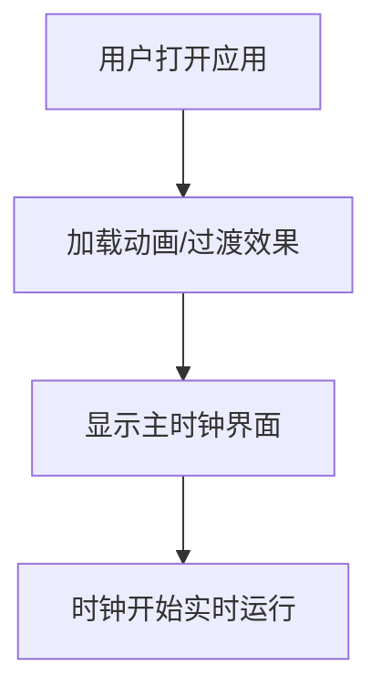
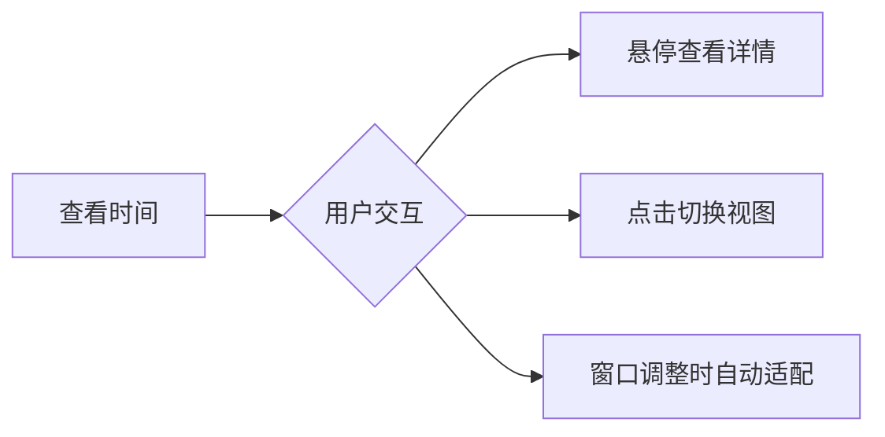

# 时钟 Web 应用 - 产品需求文档

## 1. 产品概述

一款具有赛博朋克美学的沉浸式时钟应用，将经典时钟功能与现代霓虹视觉效果完美融合。旨在为用户提供一个令人惊叹的视觉体验，同时满足日常时间查看需求。

### 产品定位
- **目标用户**：追求视觉美感和技术感的技术爱好者、设计师、夜猫子
- **核心价值**：将普通的时间显示转化为一场视觉盛宴，结合实用功能与艺术表达
- **市场定位**：高端个性化时钟工具，区别于传统单调的时钟界面

## 2. 核心功能

### 2.1 模拟时钟组件
- 圆形表盘设计，带有霓虹发光效果
- 精确的时、分、秒针，带有轨迹残影效果
- 12小时制刻度，带有柔和的光晕
- 秒针的流畅动画，每秒60帧更新

### 2.2 数字时钟组件
- 大号霓虹字体显示时间
- 24小时制，精确到秒
- 数字发光效果，带有辉光（glow）动画
- 冒号闪烁效果，模拟真实数字时钟

### 2.3 日期与星期信息
- 当前日期显示（年月日）
- 星期几的中文显示
- 带有装饰性边框和霓虹效果

### 2.4 动态背景效果
- 赛博朋克风格的网格背景
- 缓慢移动的扫描线效果
- 微妙的粒子或光点漂浮效果
- 深色渐变基底，配合霓虹色调

### 2.5 时区显示
- 显示当前时区名称（如 Asia/Shanghai）
- UTC 偏移量显示

### 2.6 交互功能
- 点击切换数字时钟和模拟时钟的显示比例
- 悬停时显示详细时间信息
- 响应式设计，适配各种屏幕尺寸

## 3. 核心流程

### 3.1 用户首次访问流程


### 3.2 主要交互流程


## 4. 用户界面设计

### 4.1 设计风格：赛博朋克霓虹风格

#### 色彩方案
- **主色调**：深紫黑色背景 (#0a0a0f)
- **霓虹青色**（主时钟）：#00fff9
- **霓虹粉色**（秒针/强调）：#ff00ff
- **霓虹橙色**（警告/特殊）：#ff6600
- **霓虹紫色**（装饰元素）：#bf00ff

#### 字体选择
- **数字显示**：Orbitron（科幻感强）或 JetBrains Mono（技术感）
- **日期文本**：Rajdhani（现代几何感）

#### 视觉效果
- 霓虹发光效果（text-shadow 多层叠加）
- 扫描线叠加效果（repeating-linear-gradient）
- 网格背景（极细线条，透明度低）
- 动态模糊和辉光动画

### 4.2 页面布局设计

#### 主界面布局
```
┌─────────────────────────────────────┐
│         动态背景（网格+扫描线）          │
│  ┌─────────────────────────────┐    │
│  │         日期 + 星期            │    │
│  │     ═══════════════════      │    │
│  │                              │    │
│  │      ┌───────────────┐      │    │
│  │      │   模拟时钟     │      │    │
│  │      │   (霓虹风格)   │      │    │
│  │      └───────────────┘      │    │
│  │                              │    │
│  │      ╔═══════════════╗      │    │
│  │      ║  数字时钟      ║      │    │
│  │      ║  HH:MM:SS     ║      │    │
│  │      ╚═══════════════╝      │    │
│  │                              │    │
│  │     时区: Asia/Shanghai      │    │
│  │     UTC+8                    │    │
│  └─────────────────────────────┘    │
└─────────────────────────────────────┘
```

#### 组件层级
1. **背景层**：动态网格 + 扫描线 + 粒子效果
2. **内容层**：中央时钟容器
3. **时钟层**：模拟时钟 + 数字时钟
4. **信息层**：日期、星期、时区信息

### 4.3 响应式设计

#### 桌面端 (≥1024px)
- 模拟时钟直径：400px
- 数字时钟字号：72px
- 完整布局，所有元素并排或堆叠显示

#### 平板端 (768px - 1023px)
- 模拟时钟直径：300px
- 数字时钟字号：56px
- 保持核心视觉效果

#### 移动端 (< 768px)
- 模拟时钟直径：250px
- 数字时钟字号：48px
- 优化触摸交互
- 简化背景动画以提升性能

### 4.4 动画设计

#### 时钟指针动画
- 秒针：平滑连续旋转（CSS transition: 1s linear）
- 分针：每分钟移动 6°（平滑过渡）
- 时针：每小时移动 30°（平滑过渡）

#### 霓虹呼吸效果
- 主色调霓虹：柔和的明暗变化，周期 2-3 秒
- 使用 CSS animation + opacity 变化

#### 背景扫描线
- 水平扫描线缓慢下移
- 周期：8-10 秒
- 透明度：0.03-0.05

#### 页面加载过渡
- 初始：时钟组件从透明淡入
- 时钟指针从 12 点位置开始顺时针旋转到当前位置
- 总时长：1-1.5 秒

## 5. 技术约束

### 5.1 性能要求
- 60 FPS 流畅动画
- 首次加载时间 < 2 秒
- 低 CPU 占用（优化背景动画）

### 5.2 浏览器兼容性
- 现代浏览器：Chrome, Firefox, Safari, Edge 最新版本
- 支持 CSS Grid, Flexbox
- 支持 CSS 动画和过渡效果

### 5.3 可访问性
- 高对比度模式支持
- 减少动画选项（prefers-reduced-motion）
- 屏幕阅读器友好的语义化 HTML
