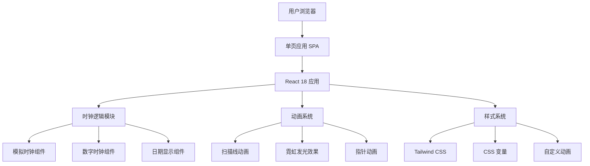

# 时钟 Web 应用 - 技术架构文档

## 1. 架构设计



## 2. 技术栈

### 前端技术
- **框架**：React 18
- **构建工具**：Vite
- **样式**：Tailwind CSS 3 + 自定义 CSS
- **动画**：CSS 动画 + React state
- **字体**：Google Fonts (Orbitron, Rajdhani)

### 项目结构
```
clock-app/
├── public/
│   └── favicon.ico
├── src/
│   ├── components/
│   │   ├── Clock/
│   │   │   ├── AnalogClock.jsx
│   │   │   ├── DigitalClock.jsx
│   │   │   ├── ClockFace.jsx
│   │   │   └── ClockHands.jsx
│   │   ├── Background/
│   │   │   ├── GridBackground.jsx
│   │   │   └── ScanlineEffect.jsx
│   │   ├── Info/
│   │   │   ├── DateDisplay.jsx
│   │   │   └── TimezoneDisplay.jsx
│   │   └── Layout/
│   │       └── ClockContainer.jsx
│   ├── hooks/
│   │   └── useClock.js
│   ├── utils/
│   │   └── timeUtils.js
│   ├── styles/
│   │   ├── index.css
│   │   └── animations.css
│   ├── App.jsx
│   └── main.jsx
├── index.html
├── package.json
├── vite.config.js
├── tailwind.config.js
└── postcss.config.js
```

## 3. 路由定义

由于是单页应用，采用简单的视图切换而非路由：

| 视图 | 组件 | 描述 |
|------|------|------|
| 主视图 | ClockContainer | 显示完整时钟界面 |
| 切换逻辑 | 状态管理 | 点击切换数字/模拟时钟显示 |

## 4. 核心组件设计

### 4.1 AnalogClock 组件
**功能**：渲染圆形模拟时钟

**Props**：
- `size`: 尺寸（默认 400）
- `borderColor`: 边框颜色（霓虹青色）
- `glowColor`: 发光颜色

**内部组件**：
- `ClockFace`：表盘和刻度
- `ClockHands`：时针、分针、秒针

### 4.2 DigitalClock 组件
**功能**：渲染数字时钟

**Props**：
- `hours`: 小时 (0-23)
- `minutes`: 分钟 (0-59)
- `seconds`: 秒 (0-59)
- `blink`: 是否闪烁冒号

**样式**：
- 大号霓虹字体
- 多层 text-shadow 实现发光效果
- 数字等宽对齐

### 4.3 DateDisplay 组件
**功能**：显示当前日期和星期

**显示格式**：
- 日期：YYYY年MM月DD日
- 星期：星期一 / 星期二 / ... / 星期日

### 4.4 TimezoneDisplay 组件
**功能**：显示时区信息

**显示内容**：
- 时区名称（Intl.DateTimeFormat().resolvedOptions().timeZone）
- UTC 偏移量

### 4.5 Background 组件
**功能**：赛博朋克风格动态背景

**效果层**：
1. 深色渐变背景
2. 极细网格线（10% 透明度）
3. 移动的扫描线（0.03 透明度）
4. 可选：漂浮光点

## 5. 自定义 Hook

### useClock Hook
```javascript
// 功能：提供实时时钟数据
// 返回值：
{
  hours: number,      // 0-23
  minutes: number,   // 0-59
  seconds: number,   // 0-59
  dayOfWeek: number,  // 0-6 (0=周日)
  date: Date,         // 当前 Date 对象
  timezone: string,   // 时区名称
  utcOffset: number   // UTC 偏移（分钟）
}
```

**实现要点**：
- 使用 `setInterval` 每秒更新
- 组件卸载时清理定时器
- 使用 `useRef` 存储定时器 ID

## 6. 工具函数

### timeUtils.js
```javascript
// 格式化时间
formatTime(hours, minutes, seconds): string
formatDate(date): string
getDayName(dayOfWeek): string
getTimezoneInfo(): { name, offset }
```

## 7. 样式架构

### 7.1 Tailwind 配置
扩展默认配置，添加霓虹色彩和自定义动画：

```javascript
// tailwind.config.js
module.exports = {
  theme: {
    extend: {
      colors: {
        cyber: {
          bg: '#0a0a0f',
          cyan: '#00fff9',
          pink: '#ff00ff',
          orange: '#ff6600',
          purple: '#bf00ff'
        }
      },
      fontFamily: {
        orbitron: ['Orbitron', 'sans-serif'],
        rajdhani: ['Rajdhani', 'sans-serif']
      }
    }
  }
}
```

### 7.2 CSS 变量
```css
:root {
  --neon-cyan: #00fff9;
  --neon-pink: #ff00ff;
  --neon-purple: #bf00ff;
  --bg-dark: #0a0a0f;
  --glow-intensity: 0.8;
}
```

### 7.3 霓虹发光效果
```css
.neon-text {
  color: var(--neon-cyan);
  text-shadow:
    0 0 5px var(--neon-cyan),
    0 0 10px var(--neon-cyan),
    0 0 20px var(--neon-cyan),
    0 0 40px var(--neon-cyan);
}

.neon-border {
  border: 2px solid var(--neon-cyan);
  box-shadow:
    0 0 5px var(--neon-cyan),
    inset 0 0 5px rgba(0, 255, 249, 0.3);
}
```

## 8. 性能优化

### 8.1 动画优化
- 使用 `transform` 和 `opacity` 进行动画（GPU 加速）
- 避免动画中修改布局属性
- 扫描线效果使用 CSS `background-position` 动画

### 8.2 React 优化
- 使用 `React.memo` 包装纯展示组件
- 避免不必要的重新渲染
- 清理定时器防止内存泄漏

### 8.3 资源加载
- Google Fonts 使用 `display=swap` 优化加载
- 延迟加载非关键样式

## 9. 可访问性

### 9.1 屏幕阅读器
- 使用 `<time>` 元素标记时间
- `aria-label` 提供语义化描述
- 隐藏装饰性动画

### 9.2 运动敏感
```css
@media (prefers-reduced-motion: reduce) {
  .scanline,
  .floating-particles {
    animation: none;
  }
}
```

### 9.3 键盘导航
- 确保所有交互元素可通过 Tab 访问
- 提供焦点样式

## 10. 浏览器支持

- Chrome 90+
- Firefox 88+
- Safari 14+
- Edge 90+

所有目标浏览器均支持：
- CSS Grid
- CSS Custom Properties
- CSS Animations
- ES6+ JavaScript
