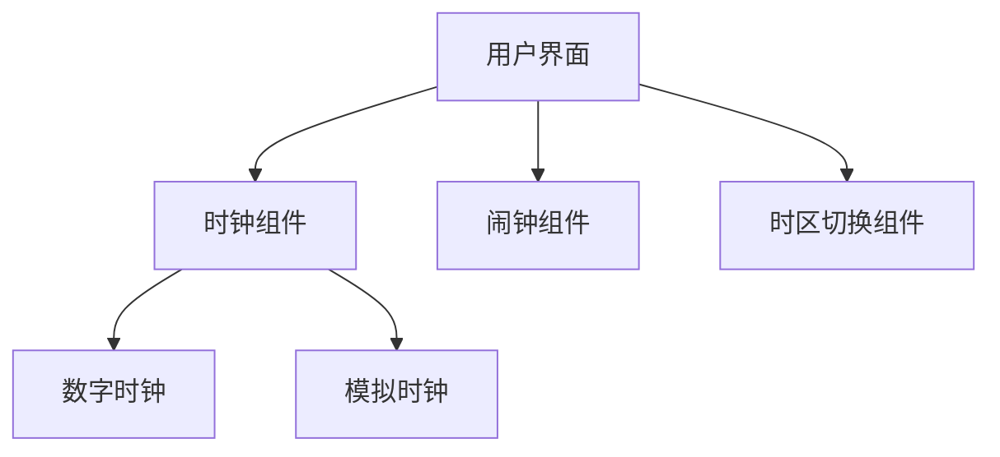

## 1. Architecture Design
这是一个纯前端的时钟应用，使用React构建，没有后端依赖。



## 2. Technology Description
- **前端**: React@18 + TypeScript + tailwindcss@3 + vite
- **初始化工具**: vite-init
- **后端**: 无（纯前端应用）
- **数据库**: 无
- **额外依赖**: lucide-react（图标库）

## 3. Route Definitions
| Route | Purpose |
|-------|---------|
| / | 主页面，显示时钟和功能控件 |

## 4. File Structure
```
/workspace
├── src/
│   ├── components/
│   │   ├── DigitalClock.tsx      # 数字时钟组件
│   │   ├── AnalogClock.tsx       # 模拟时钟组件
│   │   ├── ClockContainer.tsx    # 时钟容器组件
│   │   └── Controls.tsx          # 控制面板组件
│   ├── hooks/
│   │   └── useClock.ts           # 时钟自定义钩子
│   ├── pages/
│   │   └── Home.tsx              # 主页面
│   ├── App.tsx                   # 应用入口组件
│   └── main.tsx                  # React入口文件
├── index.html
├── package.json
├── tsconfig.json
├── vite.config.ts
├── tailwind.config.js
└── postcss.config.js
```

## 5. Component Design
### 5.1 组件职责划分
- **DigitalClock.tsx**: 负责数字时钟的渲染
- **AnalogClock.tsx**: 负责模拟时钟的渲染和动画
- **ClockContainer.tsx**: 管理时钟模式切换和布局
- **Controls.tsx**: 提供时钟模式切换、闹钟设置等功能控件
- **Home.tsx**: 主页面组件，整合所有功能
- **useClock.ts**: 处理时间更新逻辑的自定义钩子

### 5.2 状态管理
使用React的useState和useEffect进行本地状态管理，不需要额外的状态管理库。

## 6. 核心功能实现
### 6.1 时钟更新
- 使用setInterval每秒更新当前时间
- 使用Date对象获取时间信息
- 支持时区切换

### 6.2 模拟时钟
- 使用SVG绘制时钟表盘和指针
- 使用CSS动画实现指针转动效果
- 计算时针、分针、秒针的旋转角度
