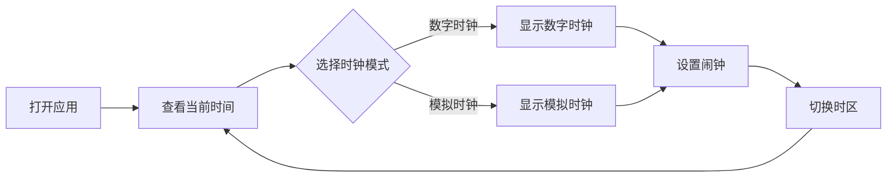

## 1. Product Overview
一个美观、功能丰富的时钟Web应用，支持多种时钟展示模式和功能。
- 为用户提供实时时间显示、闹钟设置、时区切换等功能
- 提供美观的视觉效果和流畅的动画体验

## 2. Core Features

### 2.1 Feature Module
1. **主页面**: 时钟显示、时钟模式切换
2. **闹钟功能**: 闹钟设置和管理
3. **时区切换**: 支持多时区显示

### 2.3 Page Details
| Page Name | Module Name | Feature description |
|-----------|-------------|---------------------|
| 主页面 | 数字时钟 | 显示当前时间，包括小时、分钟、秒 |
| 主页面 | 模拟时钟 | 显示模拟时钟，指针转动动画 |
| 主页面 | 日期显示 | 显示当前日期 |
| 闹钟功能 | 闹钟设置 | 设置和管理闹钟 |
| 时区切换 | 时区选择 | 选择不同时区查看时间 |

## 3. Core Process
用户打开应用后，可以在数字时钟和模拟时钟之间切换，查看当前日期，设置闹钟，以及切换不同时区查看时间。

## 4. User Interface Design
### 4.1 Design Style
- **主色调**: 深蓝色 (#1e3a8a) 和浅蓝色 (#3b82f6)
- **辅助色**: 金色 (#f59e0b) 和白色 (#ffffff)
- **按钮风格**: 圆角矩形，带悬停效果和阴影
- **字体**: 使用现代无衬线字体，如 'Poppins'
- **布局风格**: 居中布局，卡片式设计
- **动画**: 平滑的过渡动画和微妙的悬停效果

### 4.2 Page Design Overview
| Page Name | Module Name | UI Elements |
|-----------|-------------|-------------|
| 主页面 | 时钟容器 | 居中卡片，带有渐变背景和精致阴影 |
| 主页面 | 数字时钟 | 大号数字，带发光效果 |
| 主页面 | 模拟时钟 | 圆形时钟，彩色指针 |
| 闹钟功能 | 闹钟设置 | 简洁的表单设计 |

### 4.3 Responsiveness
- 桌面端优先，响应式适配
- 移动端优化，支持触摸操作

### 4.4 视觉风格
- 深色背景配合明亮的时钟元素
- 柔和的动画效果，提升用户体验
- 精致的细节设计，如渐变、阴影和发光效果
